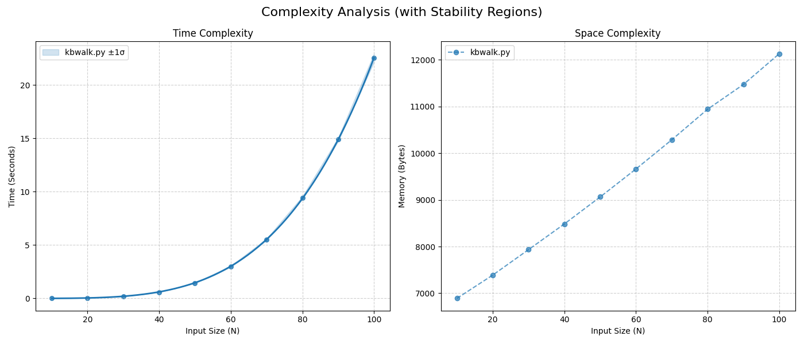

# Keyboard Walk Generator

A high-performance Python tool for generating password wordlists based on keyboard walking patterns (e.g., `1qaz`, `xsw2`, `qwer`). This tool is optimized for speed using buffered I/O and C-based iterators to handle massive lists (33M+ combinations) efficiently.

## Files

* **`kbwalk.py`**: The all-in-one generator with built-in hashing support.
* **`LICENSE`**: BSD-2-Clause License.

## Features

* **High Performance:** Uses `itertools` and buffered writing to generate ~33 million lines in seconds.
* **Modes:** Supports Vertical (`1qaz`), Horizontal (`qwerty`), or Both.
* **Multi-Hashing:** Can generate **NTLM**, **MD5**, **SHA1**, or **SHA256** hashes directly to skip piping overhead.
* **Progress Bar:** Includes an optional, high-speed progress bar (requires `tqdm`).
* **Flexible Output:** Supports raw hash lists or `password:hash` format.

## Installation

The script runs on standard Python 3 libraries. However, for a real-time progress bar, you can install `tqdm`:

```bash
pip install tqdm

```

*If `tqdm` is not installed, the script automatically falls back to a simple text counter.*

## Usage

### 1. Standard Wordlist Generation

Generate the classic 33 million vertical keyboard walk list:

```bash
python3 kbwalk.py -m v -f wordlist.txt

```

Generate a horizontal walk list (length 4) and print to STDOUT (for piping):

```bash
python3 kbwalk.py -m h -l 4

```

### 2. Hash Generation (Rainbow Tables)

Generate a list of **NTLM** hashes directly (useful for Windows auditing):

```bash
python3 kbwalk.py -m v --hash ntlm -f ntlm_hashes.txt

```

Generate **MD5** hashes:

```bash
python3 kbwalk.py -m v --hash md5 -f md5_hashes.txt

```

Generate in `password:hash` format for verification:

```bash
python3 kbwalk.py -m v --hash sha1 --format pwd:hash -f combos.txt

```

### Arguments

* `--help`: Show the help menu, explaining basic flag options and usage.
* `-m`, `--mode`: Pattern mode (`v` = vertical, `h` = horizontal, `b` = both).
* `-f`, `--file`: Output filename (optional, prints to STDOUT if omitted).
* `-l`, `--length`: Length of horizontal walk segments (default: 4).
* `--hash`: Hashing algorithm to apply (`ntlm`, `md5`, `sha1`, `sha256`, `none`).
* `--format`: Output format (`plain` = hash only, `pwd:hash` = password and hash).

## Performance Testing (Occam)

This script includes a developer hook for the [Occam Complexity Scanner](https://github.com/antonhibl/occam). To verify the time and space complexity efficiency:

1. Clone or install Occam.
2. Run the following command against `kbwalk.py`:

```bash
python3 occam.py kbwalk.py --type list --max_n 80 --output complexity.png

```

**⚠️ Warning:** Keep `--max_n` below 100. The algorithm is mathematically O(N^4) for it's time complexity, so high values will result in excessively long runtimes. This test confirms that while Time Complexity is polynomial, **Space Complexity remains efficient (Logarithmic/Constant)** due to the generator implementation.

Here are my results running the scanner myself:

```bash
┌──(occam-env)(kali@kali)-[~/occam]
└─$ python3 occam.py testing/kbwalk.py --type list --max_n 100 --dump --output testing/kbwalk_graph.png
===========================================================================
Analyzing: ../keyb-walking/kbwalk.py
Pattern:   random
===========================================================================

-----------------------------------------------------------------
STATIC ANALYSIS: run_analysis_entry
-----------------------------------------------------------------
Lines of Code (LOC):       7
Cyclomatic Complexity:     4 (Low)
Max Loop Nesting:          1 -> Likely O(N)
Variable Accesses ([]):    0
Math Operations:           0
Function Calls:            6
Bytecode Instructions:     78
Control Flow Jumps:        7

[Bytecode Dump]
 141            RESUME                   0

 142            LOAD_GLOBAL              1 (isinstance + NULL)
                LOAD_FAST                1 (data)
                LOAD_GLOBAL              2 (list)
                CALL                     2
                TO_BOOL
                POP_JUMP_IF_FALSE       28 (to L5)
                LOAD_FAST                1 (data)
                GET_ITER
                LOAD_FAST_AND_CLEAR      2 (x)
                SWAP                     2
        L1:     BUILD_LIST               0
                SWAP                     2
                GET_ITER
        L2:     FOR_ITER                14 (to L3)
                STORE_FAST               2 (x)
                LOAD_GLOBAL              5 (str + NULL)
                LOAD_FAST                2 (x)
                CALL                     1
                LIST_APPEND              2
                JUMP_BACKWARD           16 (to L2)
        L3:     END_FOR
                POP_TOP
        L4:     STORE_FAST               3 (segments)
                STORE_FAST               2 (x)
                JUMP_FORWARD            61 (to L11)

 143    L5:     LOAD_GLOBAL              1 (isinstance + NULL)
                LOAD_FAST                1 (data)
                LOAD_GLOBAL              6 (int)
                CALL                     2
                TO_BOOL
                POP_JUMP_IF_FALSE       37 (to L10)
                LOAD_GLOBAL              9 (range + NULL)
                LOAD_FAST                1 (data)
                CALL                     1
                GET_ITER
                LOAD_FAST_AND_CLEAR      4 (i)
                SWAP                     2
        L6:     BUILD_LIST               0
                SWAP                     2
                GET_ITER
        L7:     FOR_ITER                14 (to L8)
                STORE_FAST               4 (i)
                LOAD_GLOBAL              5 (str + NULL)
                LOAD_FAST                4 (i)
                CALL                     1
                LIST_APPEND              2
                JUMP_BACKWARD           16 (to L7)
        L8:     END_FOR
                POP_TOP
        L9:     STORE_FAST               3 (segments)
                STORE_FAST               4 (i)
                JUMP_FORWARD             3 (to L11)

 144   L10:     LOAD_CONST               1 ('1qaz')
                BUILD_LIST               1
                STORE_FAST               3 (segments)

 146   L11:     LOAD_GLOBAL             11 (generate_stream + NULL)
                LOAD_FAST                3 (segments)
                CALL                     1
                STORE_FAST               5 (iterator)

 147            LOAD_FAST                5 (iterator)
                GET_ITER
       L12:     FOR_ITER                 3 (to L13)
                STORE_FAST               6 (_)
                JUMP_BACKWARD            5 (to L12)
       L13:     END_FOR
                POP_TOP
                RETURN_CONST             0 (None)

  --   L14:     SWAP                     2
                POP_TOP

 142            SWAP                     2
                STORE_FAST               2 (x)
                RERAISE                  0

  --   L15:     SWAP                     2
                POP_TOP

 143            SWAP                     2
                STORE_FAST               4 (i)
                RERAISE                  0
ExceptionTable:
  L1 to L4 -> L14 [2]
  L6 to L9 -> L15 [2]
-----------------------------------------------------------------
N        | Time (avg)   | Time StdDev  | Memory (avg) | Stability (CV)
---------------------------------------------------------------------------
10       | 0.002631     | 0.000537     | 6890         | 0.2041
20       | 0.037357     | 0.002002     | 7388         | 0.0536
30       | 0.185902     | 0.002776     | 7934         | 0.0149
40       | 0.568012     | 0.002869     | 8484         | 0.0051
50       | 1.440236     | 0.029502     | 9063         | 0.0205
60       | 2.981394     | 0.062462     | 9662         | 0.0210
70       | 5.517863     | 0.081578     | 10288        | 0.0148
80       | 9.416191     | 0.131528     | 10943        | 0.0140
90       | 14.893127     | 0.171332     | 11473        | 0.0115
100      | 22.543129     | 0.395457     | 12131        | 0.0175
---------------------------------------------------------------------------
Time Slope:  3.95 (R^2: 0.9999) -> O(n^k) Polynomial or Exponential
Space Slope: 0.25 -> O(log n) Logarithmic

Generating visualization -> testing/kbwalk_graph.png ...
Done.
```



## Disclaimer

This tool is designed for security research, authorized penetration testing, and educational purposes only. The authors are not responsible for misuse.

**Original Author:** Ronald Broberg
<br>
**Edited by:** Austin Scott & Anton Hibl
